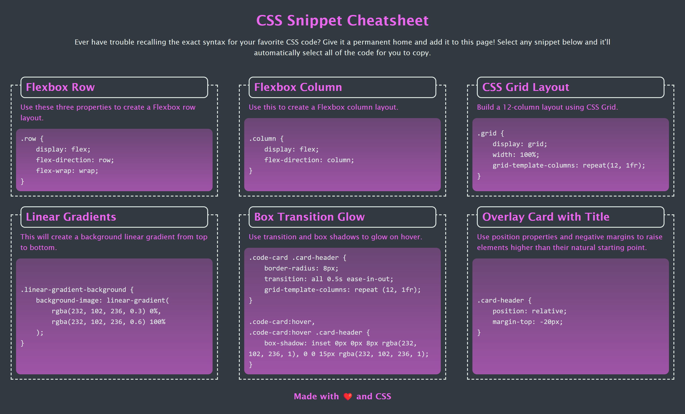

# M2-CSS-Cheatsheet

## Description

This webpage shows item cards that include snippets of CSS code. It's purpose is for the user to copy the snippets and paste them within their own projects. I made this project in order to practice advanced CSS and to give myself a cheat sheet for highly used CSS code.
While making this project I learned to:

- Use the pre tag in order to maintain spacing, indentation, and line-breaks
- Create a highlight effect upon hovering an element
- Target specific tags within a parent element
- Make parent containers stretch to fit their flexbox using "flex: 1"
- Make a website responsive based on screen size

The original Completion Criteria were as follows:
### Instructions

The completed application should meet the following criteria:

* As a user, I can view a collection of labeled CSS snippets in a responsive grid.

* As a user, I can easily identify these CSS snippets by their headings.

* As a user, I can highlight a code snippet by clicking on it.

* As a user, I can view my application on a mobile device as well as a desktop.

## Link to Deployed Site

To access the deployed site, refer to [CSS Snippet Cheatsheet](https://mateo-wallace.github.io/m2-mini-project/).

## Screenshot

